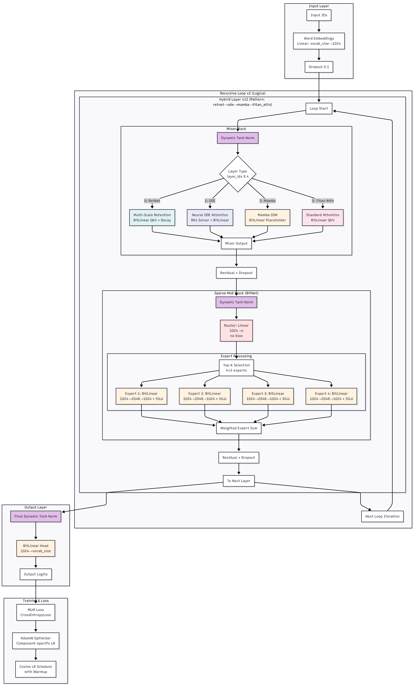

# **⚡ Titan-BERT-Ultra: The 1.58-bit Neural ODE Transformer**

**Titan-BERT-Ultra** is an audacious, "Frankenstein" architecture designed to push the limits of efficiency and logical depth on constrained hardware (specifically the **Nvidia Tesla P40 24GB**).

It abandons standard FP16 Transformers in favor of **BitNet b1.58** ternary weights, **Neural ODE** continuous dynamics, **RetNet** retention mechanisms, and **Titan** neural memory blocks.

## **🧠 Key Architectural Innovations**

### **1\. BitNet b1.58 (Ternary Weights)**

Every linear layer (nn.Linear) is replaced by a custom BitLinear.

* **Concept:** Weights are constrained to ![][image1].  
* **Impact:** Reduces memory footprint by **\~3.5x** compared to FP16.  
* **Benefit:** Allows training a massive hidden\_size=2048 model on a 24GB P40 card, where a standard BERT-Large would OOM.

### **2\. Neural ODE Attention**

Instead of discrete layers, the attention mechanism models the derivative of the hidden state over time: ![][image2].

* **Implementation:** Uses a custom **RK4 (Runge-Kutta 4\)** solver inside the forward pass.  
* **Benefit:** Parameter efficiency and continuous depth modeling.

### **3\. Multi-Scale Retention (RetNet)**

Replaces standard Softmax attention in specific layers.

* **Mechanism:** Uses a decay matrix ![][image3] to enforce locality and causal priors.  
* **Benefit:** Training parallelism of Transformers with the inference efficiency of RNNs.

### **4\. Recursive Looping & Titan Memory**

* **Looping:** The input passes through the physical layers multiple times (num\_loops). A 12-layer physical model acts as a 24+ layer logical model.  
* **Titan Memory:** A neural memory module based on "Fast Weights" that stores context dynamically, reducing reliance on massive KV caches.

## **🛠️ Hardware Optimization (The "P40 Rig")**

This code is specifically tuned for a server with:

* **GPU:** Nvidia Tesla P40 (24GB VRAM, Pascal Architecture).  
* **CPU:** Dual Xeon E5-2680v4 (28 cores each, 56 total, 112 threads).  
* **RAM:** 128GB DDR4.

**Optimizations:**

1. **BitNet Quantization:** Keeps the VRAM usage low, bypassing the P40's lack of FP16 Tensor Cores.  
2. **CPU Prefetching:** The training script utilizes the massive thread count (112 threads) to pre-process data into the 128GB RAM, minimizing NVMe bottlenecks.  
3. **Dynamic Tanh Norm:** Used instead of LayerNorm to avoid variance calculations that can be unstable with ternary weights.

## **� Training Infrastructure**

### **Stable Layer Pattern**

The training pipeline uses a research-backed stable 6-layer pattern optimized for hybrid architectures:

```
["retnet", "titan_attn", "retnet", "mamba", "titan_attn", "ode"]
```

* **RetNet anchors:** Placed at positions 0 and 2 for gradient stability
* **Mamba sandwiched:** SSM block buffered by retention layers
* **ODE at end:** Continuous dynamics placed last to avoid early instability

### **Advanced Monitoring & Logging**

| Feature | Description |
|---------|-------------|
| **CSV Metrics Logging** | Per-step logging of loss, accuracy, learning rate, and GPU memory |
| **NaN Detection** | Automatic training halt with comprehensive debug output |
| **Gradient Monitoring** | Logs gradient norms per component type for debugging |
| **Emergency Checkpoints** | Saves model state when NaN detected for analysis |

### **Checkpoint Management**

* **Rolling Checkpoints:** Saves every N steps, keeping only the last K checkpoints
* **Best Model Tracking:** Maintains top-K checkpoints by validation loss using a min-heap
* **Configurable Strategy:** All parameters controlled via `TrainingConfig` dataclass

```python
@dataclass
class TrainingConfig:
    log_csv: bool = True
    csv_log_path: str = "training_metrics.csv"
    rolling_checkpoint_every: int = 500
    keep_rolling_checkpoints: int = 3
    keep_best_checkpoints: int = 2
    detect_nan: bool = True
```

## **�📊 Architecture Diagram**



*For detailed technical documentation, see: [Technical Specification (PDF)](./tital_bert_ultra.pdf)*

## **🚀 Usage**

### **Requirements**

pip install torch sentencepiece datasets  
\# Optional: pip install torchdiffeq (if using external solver)

### **Configuration (UltraConfig)**

Edit `main.py` to adjust the model configuration:

```python
config = UltraConfig(
    vocab_size=50000,
    hidden_size=1024,           # Reduced from 2048 for stability
    num_layers=12,              # Physical layers (uses 2 cycles of 6-pattern)
    num_loops=2,                # Logical depth = 24
    num_heads=16,
    retention_heads=8,
    num_experts=4,              # Reduced MoE experts
    top_k_experts=2,
    dropout=0.1,
    ode_solver="rk4",
    ode_steps=2,                # Low steps for speed
    use_bitnet=True,            # Essential for memory efficiency
    norm_type="dynamic_tanh",
    layer_pattern=stable_layer_pattern  # Use stable pattern
)

# Stable 6-layer pattern optimized for hybrid architectures:
stable_layer_pattern = [
    "retnet",       # Stable anchor, good gradient flow
    "titan_attn",   # Proven attention mechanism
    "retnet",       # Another stable anchor
    "mamba",        # Efficient SSM, sandwiched by stable layers
    "titan_attn",   # Attention for local patterns
    "ode"           # ODE at end, more stable gradients
]
```

**Key Configuration Notes:**
- **hidden_size=1024**: Reduced from 2048 for better stability on P40 hardware
- **num_loops=2**: Creates 24 logical layers from 12 physical layers
- **use_bitnet=True**: Essential for fitting large models in 24GB VRAM
- **ode_steps=2**: Low step count balances precision with speed
- **layer_pattern**: Research-backed stable pattern with RetNet anchors

### **Training**

Run the high-throughput trainer optimized for Xeon CPUs:

python3 train\_titan\_bert.py

*Note: Ensure you have mounted a RAM disk if your NVMe is slow:*

sudo mount \-t tmpfs \-o size=64G tmpfs /mnt/ramdisk

## **📚 References & Research Sources**

This model implements concepts from the following papers:

1. **BitNet b1.58 (The 1-bit Era)**  
   * *Wang et al. (Microsoft Research, 2024\)*  
   * "The Era of 1-bit LLMs: All Large Language Models are on 1.58 Bits"  
   * [arXiv:2402.17764](https://arxiv.org/abs/2402.17764)  
2. **Neural Ordinary Differential Equations**  
   * *Chen et al. (NeurIPS 2018\)*  
   * "Neural Ordinary Differential Equations"  
   * [arXiv:1806.07366](https://arxiv.org/abs/1806.07366)  
3. **RetNet (Retention Networks)**  
   * *Sun et al. (Microsoft Research, 2023\)*  
   * "Retentive Network: A Successor to Transformer for Large Language Models"  
   * [arXiv:2307.08621](https://arxiv.org/abs/2307.08621)  
4. **Titan (Memory as Context)**  
   * *Behrouz et al. (Google DeepMind, 2025\)*  
   * "Titan: Memory as Context for Large Language Models"  
   * *Note: Refers to the concept of Neural Memory modules for context extension.*  
5. **Mamba (State Space Models)**  
   * *Gu & Dao (2023)*  
   * "Mamba: Linear-Time Sequence Modeling with Selective State Spaces"  
   * [arXiv:2312.00752](https://arxiv.org/abs/2312.00752)  
6. **HOPE (Hyperspherical Orbit Positional Embeddings)**  
   * *Concept derived from RoPE (Su et al.) extended to high-dimensional manifold projections for better extrapolation.*

## **⚠️ Disclaimer**

**This is an experimental research model.**

* **Stability:** Combining ODEs with BitNet is mathematically risky. If loss goes to NaN, try switching norm\_type to standard LayerNorm or reducing the learning rate.  
* **Performance:** While optimized for memory (VRAM), the ODE solver (RK4) is compute-intensive. Training will be slower than a vanilla Transformer, but the parameter efficiency is significantly higher.
